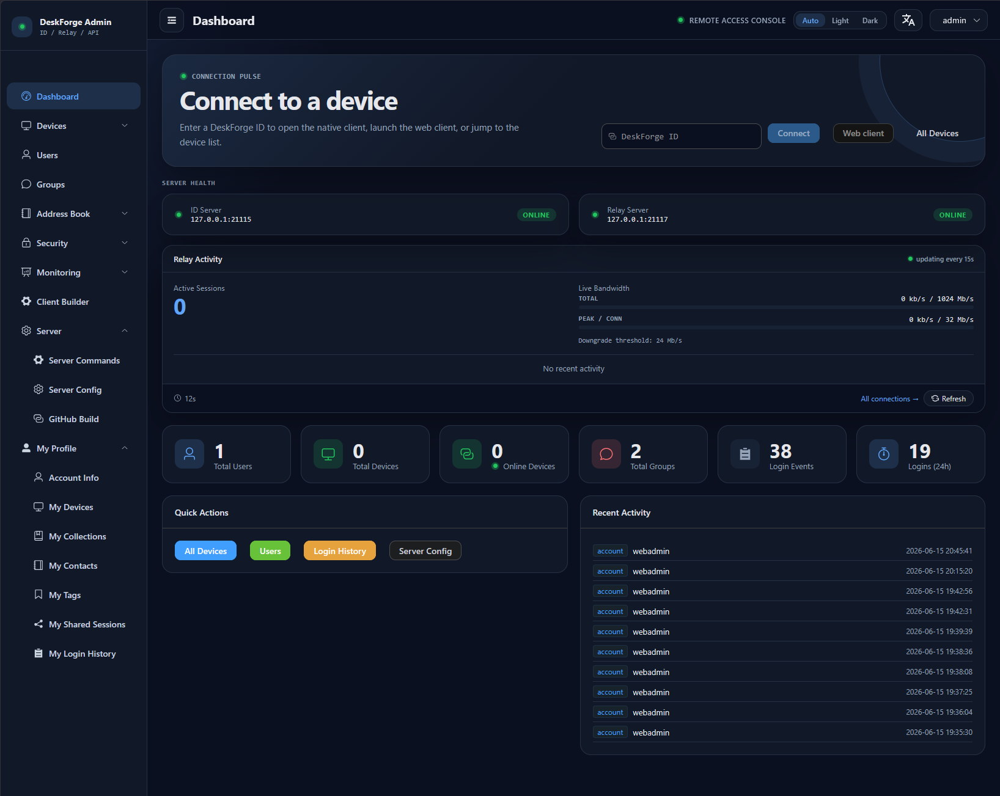
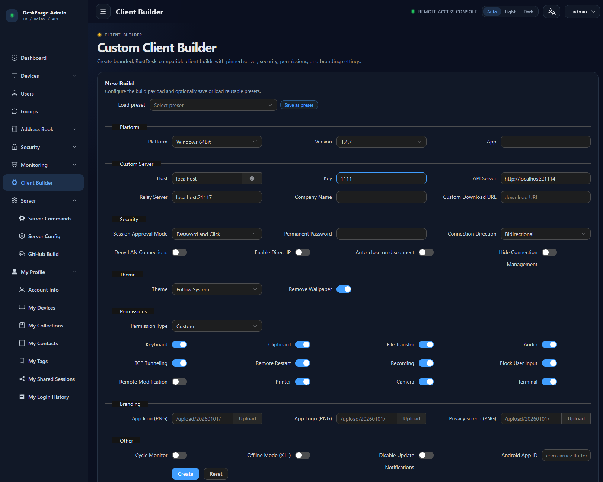

# DeskForge

Unified self-hosted RustDesk-compatible server.
Single Docker image (s6-overlay): Rust hbbs/hbbr + Go API + Vue 3 admin panel + custom client builder.

---

## Quick start

```bash
git clone https://github.com/bashrusakh/DeskForge.git
cd DeskForge/docker
# docker-compose.yml: replace your-server, your-secret-jwt-key-change-this
docker compose up -d
# Get the public key:
docker compose logs | grep "Public Key"
```

**Admin:** `http://your-server:21114/admin/` — login `admin`, password in logs.

**RustDesk client:** ID Server `your-server:21116`, Relay `:21117`, API `http://your-server:21114`, Key — from logs.

---

## Ports

| Port  | Protocol | Service          |
| ----- | -------- | ---------------- |
| 21114 | TCP      | API + Web Admin  |
| 21115 | TCP      | NAT type test    |
| 21116 | TCP/UDP  | ID Server (hbbs) |
| 21117 | TCP      | Relay Server (hbbr) |
| 21118 | TCP      | WebSocket        |

---

## Key env vars

| Variable                           | Purpose                           |
| ---------------------------------- | --------------------------------- |
| `RELAY`                              | Relay server address              |
| `ENCRYPTED_ONLY`                     | Encrypted connections only        |
| `MUST_LOGIN`                         | Require login before connect      |
| `RUSTDESK_API_RUSTDESK_ID_SERVER`    | ID server (hbbs)                  |
| `RUSTDESK_API_RUSTDESK_RELAY_SERVER` | Relay server (hbbr)               |
| `RUSTDESK_API_RUSTDESK_API_SERVER`   | API server URL                    |
| `RUSTDESK_API_KEY_FILE`              | Path to public key file           |
| `RUSTDESK_API_JWT_KEY`              | JWT secret                        |
| `RUSTDESK_API_GORM_TYPE`            | sqlite / mysql / postgres         |
| `RUSTDESK_API_LANG`                 | en / ru / zh-CN                   |
| `SECRET_CRYPT_KEY`                  | AES-GCM key for secrets at rest   |

---

## What's implemented

**Server (Rust + Go):** user CRUD, JWT, OAuth (GitHub/Google/OIDC), LDAP, groups, tags,
address book (personal + shared with collections), peer-UUID binding, audit (login/connection/file-transfer),
server commands with persistence and audit log, encrypted-at-rest secrets, SQLite/MySQL/PostgreSQL,
captcha + brute-force protection.

**Admin UI (Vue 3):** Login, Dashboard, Devices, Users, Groups, Tags, OAuth, Server Config,
Audit, Custom Client Builder, Profile, My Workspace, Guest Sharing.
3 locales (en/ru/zh_CN). Light/Dark/Auto themes.
Shared UI: DataTable, AppDialog, AppDrawer, FilterBar, ActionsToolbar.

**Custom client:** GitHub Actions → rustdesk fork → `rustqs.exe` (Windows).
Builds with your server, key, permanent password. Single-binary via portable-packer (23 MB).
Linux/Android — in development.

**Not implemented (vs RustDesk Pro):** 2FA, RBAC, session recording, device policy, remote script,
HA, backup/restore.

### Screenshots

| Dashboard | Custom Client Builder |
|---|---|
|  |  |

---

## Repository structure

```
server/          — Rust hbbs/hbbr (signal + relay)
api/             — Go REST API (Gin + GORM)
admin-ui/        — Vue 3 + Element Plus admin panel
libs/hbb_common/ — shared Rust library (submodule)
docker/          — Dockerfile + compose + entrypoint
github-build/    — active client build workflow
win-builder/     — ❄️ FROZEN: standalone Windows builder
offline-kit/     — ❄️ FROZEN: dependency freeze tool (insurance against upstream death)
rdgen/           — vendored reference workflow (not a service)
```

---

## Building

```bash
cd docker
docker compose build          # full build
docker compose up -d          # start
```

---

## Forks (for custom client builds)

- [`bashrusakh/rustdesk`](https://github.com/bashrusakh/rustdesk) — fork of rustdesk/rustdesk @ 1.4.7
- [`bashrusakh/hbb_common`](https://github.com/bashrusakh/hbb_common) — fork of rustdesk/hbb_common

See [PLAN.md §7](PLAN.md#7-workflow-new-upstream-rustdesk-client-release) for the upstream update workflow.

---

## License

AGPL-3.0 (server) + MIT (api/admin-ui). See [LICENSE](LICENSE) and [NOTICE](NOTICE).

Based on:
- [rustdesk/rustdesk-server](https://github.com/rustdesk/rustdesk-server) (AGPL-3.0)
- [lejianwen/rustdesk-api](https://github.com/lejianwen/rustdesk-api) (MIT)
