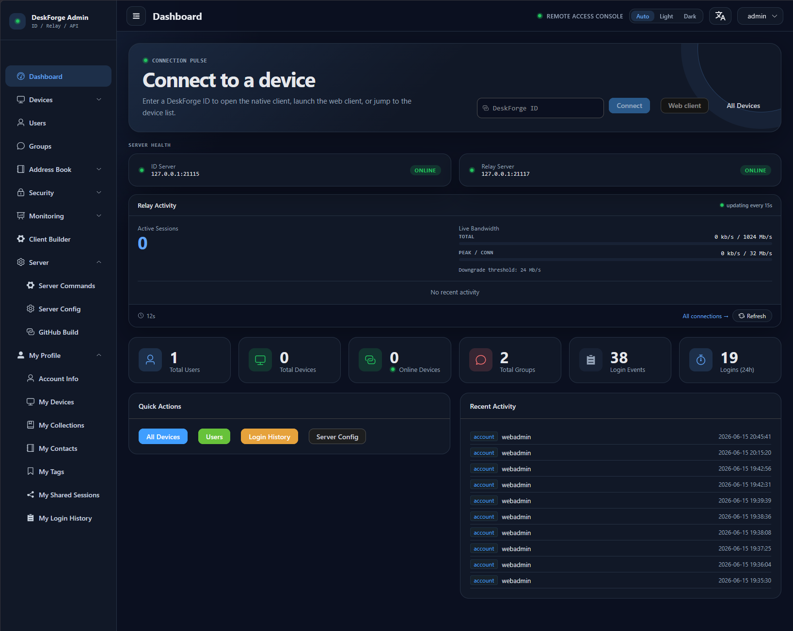
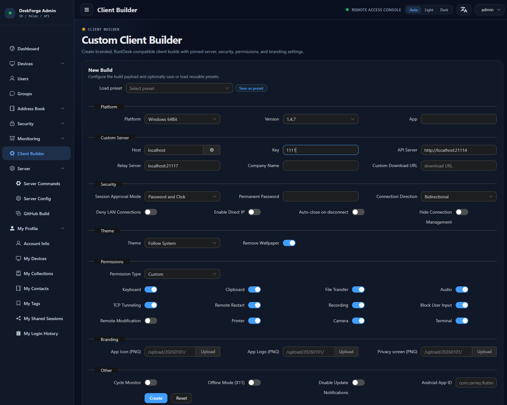

# DeskForge

Unified self-hosted RustDesk-compatible server.
Single Docker image (s6-overlay): Rust hbbs/hbbr + Go API + Vue 3 admin panel + custom client builder.

---

## Quick start

```bash
git clone https://github.com/bashrusakh/DeskForge.git
cd DeskForge/docker
# docker-compose.yml: replace your-server, your-secret-jwt-key-change-this
docker compose up -d
# Read the public key from the mounted server data path:
docker compose exec rustdesk cat /data/id_ed25519.pub
```

**Admin:** `http://your-server:21114/admin/` — login `admin`, password in logs.

**RustDesk client:** ID Server `your-server:21116`, Relay `your-server:21117`, API `http://your-server:21114`, Key — paste the public-key contents returned by `docker compose exec rustdesk cat /data/id_ed25519.pub`; the file is at `/data/id_ed25519.pub` inside the container.

---

## Ports

| Port  | Protocol | Service          |
| ----- | -------- | ---------------- |
| 21114 | TCP      | API + Web Admin  |
| 21115 | TCP      | NAT type test    |
| 21116 | TCP/UDP  | ID Server (hbbs) |
| 21117 | TCP      | Relay Server (hbbr) |
| 21118 | TCP      | WebSocket        |
| 21119 | TCP      | Relay WebSocket (hbbr) |

The protocol uses 21119 for the relay WebSocket path. The production Compose
file currently publishes 21114–21118; expose 21119 separately when that public
WebSocket path is required.

The published RustDesk client source/ref is 1.4.8 and the published DeskForge API
schema is `DatabaseVersion` 272. The current local corrective candidate targets API
schema 283; it is not published or live-provider evidence. Schema 283 adds
`idx_custom_presets_user_id_name` on `(user_id, name)`. Before `AutoMigrate`, its
preflight fails on an existing duplicate group without auto-selecting a row or deleting
data. Schema 282 remains the earlier workflow-approval migration.

---

## Key env vars

| Variable                           | Purpose                           |
| ---------------------------------- | --------------------------------- |
| `RELAY`                              | Relay server address              |
| `HBBR_PORT`                          | Relay server port                 |
| `HBBS_PORT`                          | ID/Rendezvous server port         |
| `ENCRYPTED_ONLY`                     | Encrypted connections only        |
| `MUST_LOGIN`                         | Require login before connect      |
| `RUSTDESK_API_RUSTDESK_ID_SERVER`    | ID server (hbbs)                  |
| `RUSTDESK_API_RUSTDESK_RELAY_SERVER` | Relay server (hbbr)               |
| `RUSTDESK_API_RUSTDESK_API_SERVER`   | API server URL                    |
| `RUSTDESK_API_KEY_FILE`              | Path to public key file           |
| `RUSTDESK_API_JWT_KEY`              | JWT secret                        |
| `RUSTDESK_API_GORM_TYPE`            | sqlite / mysql / postgresql       |
| `RUSTDESK_API_LANG`                 | en / ru / zh-CN                   |
| `SECRET_ENCRYPTION_KEY`             | AES-GCM key for secrets at rest |
| `SOURCE_DATE_EPOCH`                 | Trusted Docker build timestamp (optional) |

New non-empty secret writes and secret-bearing Custom Builder operations require this
key and are rejected rather than stored as plaintext when it is missing. Legacy plaintext
rows remain readable; saving them again encrypts them when the key exists.

Rust build metadata uses `SOURCE_DATE_EPOCH` when supplied. Without it, active
builds use the deterministic value `unknown`; wall-clock metadata is available
only for explicitly non-reproducible local debug builds with
`RUSTDESK_NON_REPRODUCIBLE_DEBUG=1`.

---

## What's implemented

**Server (Rust + Go):** user CRUD, JWT, OAuth (GitHub/Google/OIDC), LDAP, groups, tags,
address book (personal + shared with collections), peer-UUID binding, audit (login/connection/file-transfer),
server commands with persistence and audit log, encrypted-at-rest secrets, and configured
SQLite/MySQL/PostgreSQL drivers. SQLite is locally exercised; MySQL/PostgreSQL migration and
read/write coverage remain unverified. Captcha and brute-force protection are also included.

**Admin UI (Vue 3):** Login, Dashboard, Devices, Users, Groups, Tags, OAuth, Server Config,
Audit, Custom Client Builder, Profile, My Workspace, Guest Sharing.
3 locales (en/ru/zh_CN). Light/Dark/Auto themes.
Shared UI: DataTable, AppDialog, AppDrawer, FilterBar, ActionsToolbar.

**Custom client:** the API dispatches an owned workflow in the configured RustDesk
fork and retrieves the exact provider artifact for local validation/publication.
The published client source/ref is **1.4.8**. The current local corrective candidate
targets API schema `DatabaseVersion 283`; the published DeskForge schema remains 272.
Schema 283 adds `idx_custom_presets_user_id_name` on `(user_id, name)` and fails
preflight on existing duplicate groups rather than auto-selecting a row or deleting data.
The earlier schema-282 workflow-approval migration remains historical context.
Windows is the only capability admitted today;
Linux and Android mappings remain gated pending PR11 evidence. No live provider
run or clean-environment build is claimed. Local workflow manifests, bridge/helper
source, Android app-ID/runtime-path checks, and package assertions are static evidence
only; no APK/package/install/runtime evidence exists.
Before approval, preparation, or secret-bearing dispatch, the API requires the exact
provider-owned marker `# deskforge-workflow-identity-guard: v1` in workflow content
resolved at the immutable workflow SHA. Legacy unguarded tags fail closed. This does
not make GitHub's selector/SHA binding atomic or establish live provider readiness.
Schema-283 migration checks are SQLite-only; MySQL/PostgreSQL migration and read/write
coverage remain unverified.

### GitHub Actions PAT permissions

See the [fine-grained PAT permission checklist](api/README.md#github-fine-grained-pat-permissions)
for the custom-client workflow, including why Administration, Actions, and
Secrets write access are required.

**Not implemented (vs RustDesk Pro):** 2FA, RBAC, session recording, device policy, remote script,
HA, backup/restore.

### Screenshots

| Dashboard | Custom Client Builder |
|---|---|
|  |  |

---

## Repository structure

```
server/          — Rust hbbs/hbbr (signal + relay)
api/             — Go REST API (Gin + GORM)
admin-ui/        — Vue 3 + Element Plus admin panel
libs/hbb_common/ — tracked shared Rust library in DeskForge
docker/          — Dockerfile + compose + entrypoint
github-build/    — reference/documentation for fork workflows (no executable copies)
win-builder/     — ❄️ FROZEN: manual/historical-only standalone builder
offline-kit/     — ❄️ FROZEN: dependency-freeze tool; current verification is incomplete
rdgen/           — ❄️ FROZEN: vendored historical/reference workflow material
```

The configured RustDesk fork's `.github/workflows/` files are the sole executable
source for active client builds. `github-build/` and `rdgen/` contain reference or
frozen material only.

The repository does not currently contain a `vendor/` tree, `rustdesk-deps/` archive,
or current client-release directory. The RustDesk fork and DeskForge server manifests
still reference active third-party upstream repositories/modules; upstream independence
is therefore a goal and boundary, not a verified current property.

---

## Building

```bash
cd docker
docker compose build rustdesk # full server image
docker compose up -d rustdesk # start the rustdesk service
```

For client-build workflow maintenance, edit and validate the configured fork's
`.github/workflows/` files. `github-build/` contains reference documentation only;
it is not a deployment source. For the API development stack:

```bash
cd api
docker compose -f docker-compose-dev.yaml up -d
```

### Go verification

The broad local checks pass with the workspace disabled:

```bash
cd api
GOWORK=off go vet ./...
GOWORK=off go test ./...
```

Redis integration tests and benchmarks are opt-in and run only when
`DESKFORGE_TEST_REDIS_ADDR` is configured. No live Redis run is recorded;
MySQL/PostgreSQL, live provider, and the other release/build gates remain
unverified.

---

## Forks (for custom client builds)

- [`bashrusakh/rustdesk`](https://github.com/bashrusakh/rustdesk) — owned RustDesk fork at published client source/ref 1.4.8; current local corrective API schema target is 283
- [`bashrusakh/hbb_common`](https://github.com/bashrusakh/hbb_common) — intended fork of
  `rustdesk/hbb_common`; the configured RustDesk fork currently records the upstream
  `rustdesk/hbb_common` submodule, and its local checkout is dirty/unpublished, so clean
  fork provenance is not verified

See [PLAN.md §7](PLAN.md#7-historical-fork-maintenance-notes-for-a-new-upstream-rustdesk-client-release) for the upstream update workflow.

---

## License

The combined DeskForge distribution is identified as **AGPL-3.0** for the covered
DeskForge work. This does not relicense separate or independent components: component-level
notices and upstream licenses remain documented in [LICENSE](LICENSE) and [NOTICE](NOTICE),
and the API/admin UI retain their upstream MIT notices where applicable. The license
inventory is incomplete; no signatures or attestations are recorded, and no full
sovereignty claim is made.

Based on:
- [rustdesk/rustdesk-server](https://github.com/rustdesk/rustdesk-server) (AGPL-3.0)
- [lejianwen/rustdesk-api](https://github.com/lejianwen/rustdesk-api) (MIT)
